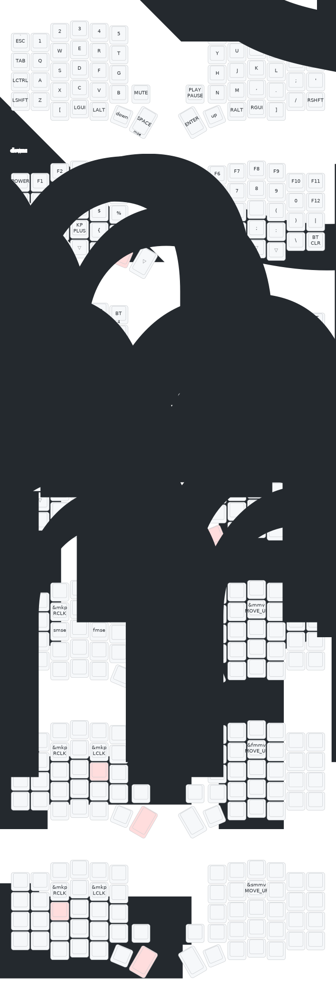

# ZMK Config for Sofle Keyboard

## Overview

Configuration for Sofle V2 keyboard with mouse support, Oled Support and more. 

## Features

- **Custom Key Mappings**: 
    - Added Mouse Support
    - Added Grave Escape & Backspace Delete
- **Layer Support**: 
    - Mouse Layers
    - Conditional Adjust Layer

## Keyboard Layout

Below is an image of the keyboard layout:

## License

This project is licensed under the [License Name] - see the [LICENSE](LICENSE) file for details.

## Acknowledgments

- [Person/Tool] for inspiration or help.
- [Resource] used for reference or guidance.
